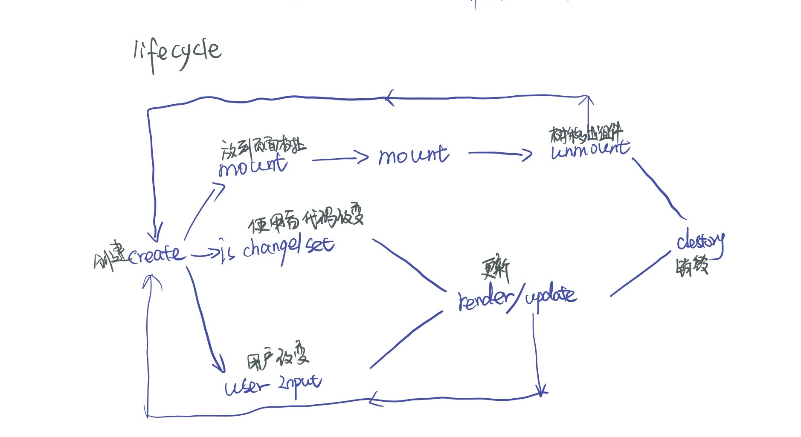

# 组件化

## 组件的基本知识｜组件的基本概念和基本组成部分

前端架构 两个热门部分 **组件化** **架构模式**

组件化就是 从怎样扩展 html 标签开始引申出来的前端的架构体系 主要目标就是**复用**

架构摸就是经常提到的 **MVC** **MVVM** 它主要关心的是 前端跟数据逻辑层之间 如何交互

组件化体系直接影响了前端团队的**复用率**

### 组件概念和基本组成部分

**对象** 属性语义要素：properties 方法 Methods 继承关系 Inherit 三要素

**模块**.

**组件** UI 强相关 特殊的模块特殊的对象 它可以以树形结构进行组合 有一定的 模版化的配置的能力 语义要素：properties Methods Inherit Attribute 特性 config 配置 State 状态 Event Lifecycle 生命周期 Children 树形结构

用户通过页面操作或输入改变组件状态 组件状态的改变可能影响组件的子组件发生改变

组件使用者使用通过 Attribute 改变组件或使组件作出反应 通过组件的 Property Methods 影响组件一般会使用 property 的 getter 和 setter 方法操作组件

组件设计者通过组件 Event 事件向使用者发送信息

**Attribute** vs **property**

Attribute 强调描述性的 形容 标记语言使用的 Attribute

```html
<my-component attribute="v" />
myComponent.getAttribute("a")
myComponent.setAttribute("a",value)
```

property 从属关系 子对象从属于父对象 和面向对象里的 property 属于一个概念

```javascript
myComponent.a = value;
```

综合看

```html
<div class="cls1,cls2" style="color:blue;"></div>
<a href="//m.taobao.com"></a>
<input value="cute" />
<script>
  var div = document.getElementsByTagName("div")[0];
  div.className; //
  div.style; //string-->key value

  var a = document.getElementsByTagName("a")[0];
  a.href; // http://... resolve 过的 HRL
  a.getAttribute("href"); //与HTML 一样

  var input = document.getElementsByTagName("input")[0];
  input.value; //cute
  input.getAttribute("value"); //cute
  input.value = "hello"; //若元素value属性已经设置 则Attribute不变，property变化 元素上实际的效果是property优先
  input.value; //hello
  input.getAttribute("value"); // cute
</script>
```

当我们设计一个组件时 Attribute 和 property 设计成等效的的还是非等效的呢 **？**

总结：语义元素使用范围

| (Markup set)  | (JS code) |  (JS Change)  | (User Input Change) | (component) |
| :--------   | :-----:   | :----: | :--------:   | :-----:   |
| N        | Y      |   Y    |Q        | property      |
| Y        | Y      |   Y    |Q        | attribute      |
| N        | N      |   N    |Y        | state      |
| N        | Y      |   N    |N        | config      |

config组件配置 **留给全局**

生命周期



children

  两种类型的children **Content** **Template**

  Content  有几个 children 写几个 content 直接反应children数目

  Template 模版 不能反应直接 的children 数目 例如无序列表 大部分情况下通过模版生成

## 组件基本知识｜为组件添加JSX语法

npm init

sudo npm install webpack webpack-cli 打包工具

npm install --save-dev webpack babel-loader

npm install --save-dev @babel/core @babel/preset-env es6转低版本js

npm install --save-dev @babel/plugin-transform-react-jsx jsx语法支持

配置webpack.config.js entry入口 module 插件 mode 模式（开发模式）

module 格式：

```javascript
module:{
  rules:[
    {
      test:/\.js$/,
      use:{
        loader:"babel-loader",
        options:{
          presets:["@babel/preset-env"]
        }
      }
    }
  ]
}
```

JSX 

把平时写的函数调用 用一个看起来很像HTML的形式

let a = <div id = "a"/> 改写一下

React.createElement()

## 轮播组件
